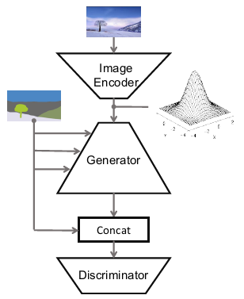
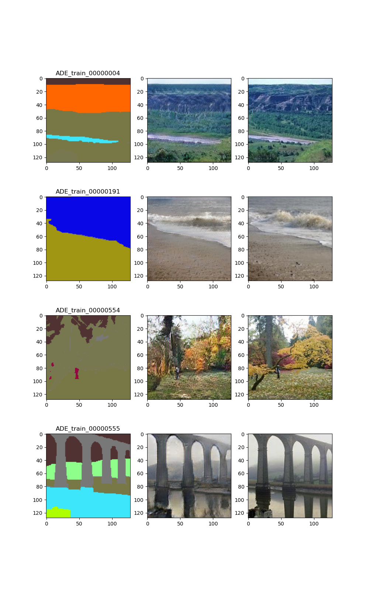
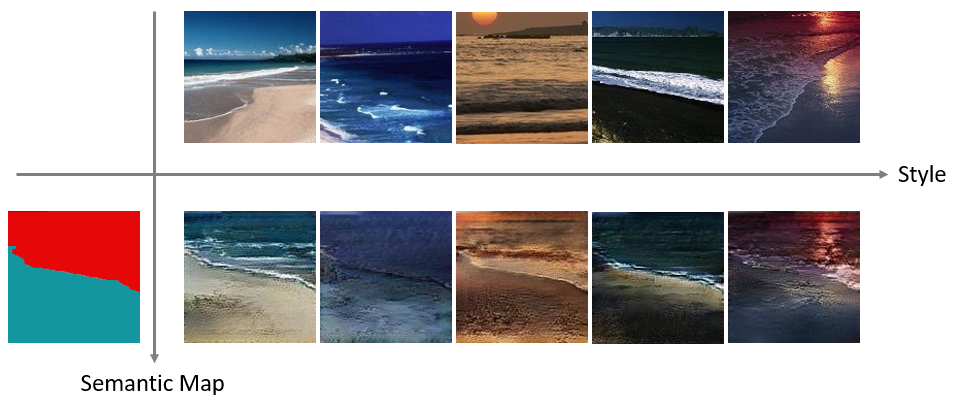
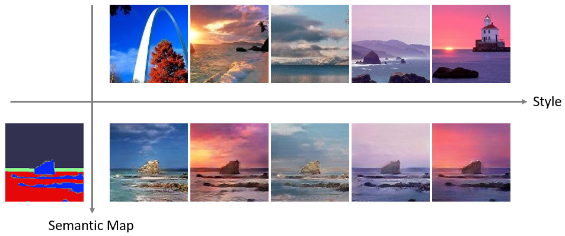
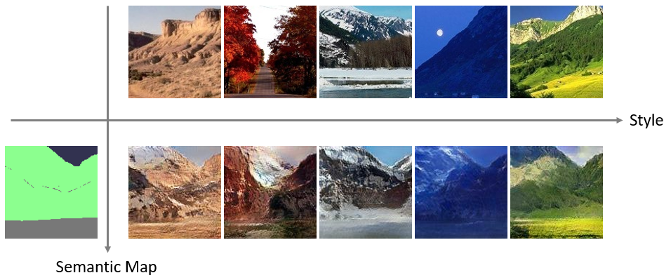

# Semantic Image Synthesis with Spatially-Adaptive Normalization

## 介紹

閱讀論文後自己實作的低解析度版本GauGAN (本人GPU不夠力...)，可以用一張semantic mask作為輪廓與另一張圖片作為想要的style進行合成，合成出來的圖片即會有前者的輪廓與後者的色彩。部分參數與與論文中不同，尤其KL-Divergence的loss權重我們調成員論文的1/50，發現效果較好。

## 資料集

[ADE20K-outdoor](https://www.kaggle.com/datasets/residentmario/ade20k-outdoors)

## 模型架構

## 實作結果

### Ground Truth Comparison

### Image Synthesis

## 參考資料
https://arxiv.org/abs/1903.07291 (原論文)